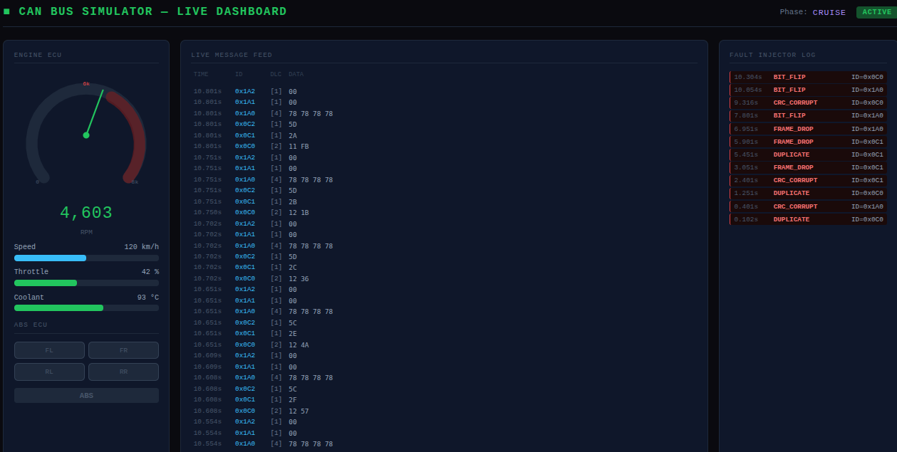

# CAN Bus Simulator

A production-accurate C++ simulator of a CAN 2.0A automotive network with three
ECU nodes, CRC-15 validation, fault injection, and a live TypeScript dashboard.



---

## Features

- **CAN 2.0A frame** 11-bit arbitration ID, CRC-15 (polynomial `0x4599`), encode/decode
- **Thread-safe priority bus** `std::priority_queue` with mutex + `condition_variable`; lower ID = higher priority, matching real CAN arbitration
- **ECU state machine** ISO 11898-1 error counters (TEC/REC), ACTIVE → WARNING → ERROR_PASSIVE → BUS_OFF transitions
- **3 ECU nodes** EngineECU (50 Hz), ABSECU (100 Hz), DashboardECU (receive-only)
- **Signal parser** big-endian (Motorola) byte extraction, bit masking
- **Fault injector** BIT_FLIP, CRC_CORRUPT, FRAME_DROP, DUPLICATE with configurable fault rate
- **GoogleTest suite** 30 tests covering all components
- **Live dashboard** TypeScript + Vite, RPM gauge, speed/throttle/coolant bars, fault log, message feed

---

## Architecture

```
┌─────────────┐   CANFrame   ┌─────────────────────────────────┐
│  EngineECU  │ ──────────► │                                 │
│  50 Hz      │             │   CANBus (priority queue)        │
└─────────────┘             │   mutex + condition_variable     │
                             │   BusState: ACTIVE/WARNING/      │
┌─────────────┐   CANFrame  │             BUS_OFF              │
│   ABSECU    │ ──────────► │                                 │
│   100 Hz    │             └──────────────┬──────────────────┘
└─────────────┘                            │ fan-out to subscribers
                                           ▼
┌──────────────────────────────────────────────────────────────┐
│  DashboardECU                                                │
│  SignalParser → RPM / Speed / Throttle / Coolant / ABS      │
└──────────────────────────────────────────────────────────────┘
                             ▲
┌─────────────┐   inject()  │
│FaultInjector│ ────────────┘
│ BIT_FLIP    │
│ CRC_CORRUPT │
│ FRAME_DROP  │
│ DUPLICATE   │
└─────────────┘
```

---

## Build

### Requirements
- CMake ≥ 3.16
- C++17 compiler (GCC 10+ / Clang 12+)
- Internet connection (GoogleTest fetched automatically)

```bash
cmake -B build -DCMAKE_BUILD_TYPE=Release
cmake --build build -j$(nproc)
```

### Run the simulator

```bash
./build/can_simulator
```

### Run tests

```bash
cd build && ctest --output-on-failure
```

---

## Dashboard

```bash
cd dashboard
npm install
npm run dev
```

Open `http://localhost:5173` for the live RPM gauge, signal bars, fault log, and message feed.

---

## Project Structure

```
CAN-Bus-Simulator/
├── include/          # Headers: CANFrame, CANBus, ECUNode, ECUs, SignalParser, FaultInjector
├── src/              # Implementations + main.cpp
├── tests/            # GoogleTest suite (30 tests)
├── dashboard/        # TypeScript + Vite live viewer
├── docs/
│   ├── design.md          # Architecture & design decisions
│   └── can-protocol.md    # Mini DBC signal definitions
└── CMakeLists.txt
```

---

## CAN Protocol

See [`docs/can-protocol.md`](docs/can-protocol.md) for the full signal table.

| Message ID | Name              | Sender      | Rate   |
|------------|-------------------|-------------|--------|
| `0x0C0`    | ENGINE_RPM        | EngineECU   | 50 Hz  |
| `0x0C1`    | ENGINE_THROTTLE   | EngineECU   | 50 Hz  |
| `0x0C2`    | ENGINE_COOLANT    | EngineECU   | 50 Hz  |
| `0x1A0`    | ABS_WHEEL_SPEED   | ABSECU      | 100 Hz |
| `0x1A1`    | ABS_BRAKE_STATUS  | ABSECU      | 100 Hz |
| `0x1A2`    | ABS_ACTIVE        | ABSECU      | 100 Hz |

---

## Relevance to Automotive Industry

| Concept | Where it appears |
|---------|-----------------|
| CAN 2.0A frame + CRC-15 | ISO 11898-1, AUTOSAR ComStack |
| ECU state machine (TEC/REC) | Every production ECU |
| Priority-based arbitration | Real CAN bus hardware |
| Motorola byte order | Bosch DBC / Vector CANdb++ |
| Fault injection | HIL testing (dSPACE, Vector CANoe) |
| Signal parsing | AUTOSAR Signal Interface layer |

---

## License

MIT
